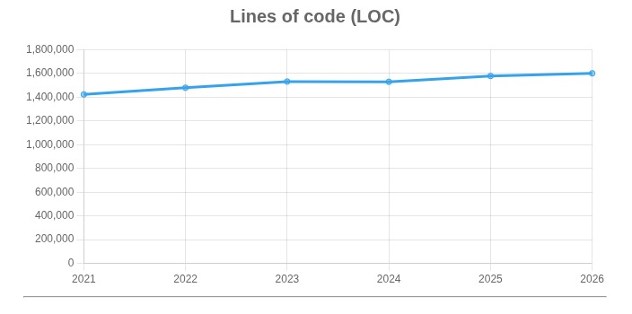
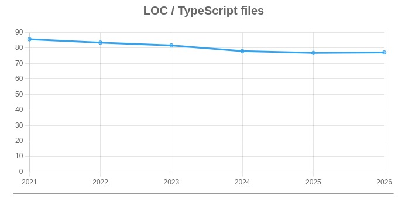
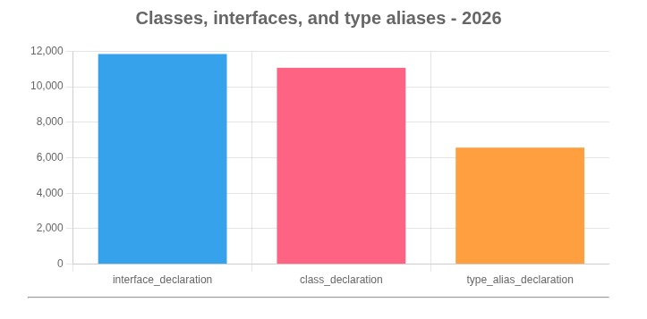
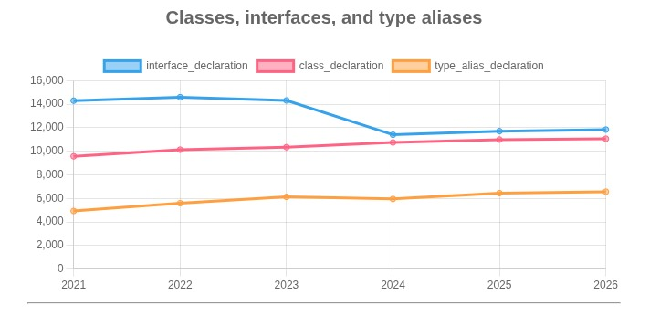
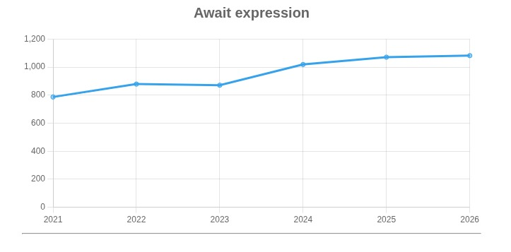

# Explorando evolução de código

Neste exercício, iremos explorar a evolução de código em sistemas reais.

Iremos utilizar a ferramenta [GitEvo](https://github.com/andrehora/gitevo).
Essa ferramenta analisa a evolução de código em repositórios Git nas linguagens Python, JavaScript, TypeScript e Java, e gera relatórios `HTML` como [este](https://andrehora.github.io/gitevo-examples/python/pandas.html).

Mais exemplos de relatórios podem ser podem ser encontrados em https://github.com/andrehora/gitevo-examples.

# Passo 1: Selecionar repositório a ser analisado

Selecione um repositório relevante na linguagem de sua preferência (Python, JavaScript, TypeScript ou Java).
Você pode encontrar projetos interessantes nos links abaixo:

- Python: https://github.com/topics/python?l=python
- JavaScript: https://github.com/topics/javascript?l=javascript
- TypeScript: https://github.com/topics/typescript?l=typescript
- Java: https://github.com/topics/java?l=java

# Passo 2: Instalar e rodar a ferramenta GitEvo

> [!NOTE]
> Antes de instalar a ferramenta, é recomendado criar e ativar um [ambiente virtual Python](https://packaging.python.org/en/latest/guides/installing-using-pip-and-virtual-environments/#create-and-use-virtual-environments).

Instale a ferramenta [GitEvo](https://github.com/andrehora/gitevo) com o comando:

```
$ pip install gitevo
```

Execute a ferramenta no repositório selecionado utilizando o comando abaixo (ajuste conforme a linguagem do repositório).
Substitua `<git_url>` pela URL do repositório que será analisado:

```shell
# Python
$ gitevo -r python <git_url>

# JavaScript
$ gitevo -r javascript <git_url>

# TypeScript
$ gitevo -r typescript <git_url>

# Java
$ gitevo -r java <git_url>
```

Por exemplo, para analisar o projeto Flask escrito em Python:

```
$ gitevo -r python https://github.com/pallets/flask
```

> [!NOTE]
> Essa etapa pode demorar alguns minutos pois o projeto será clonado e analisado localmente.

# Passo 3: Explorar o relatório de evolução de código

Após executar a ferramenta [GitEvo](https://github.com/andrehora/gitevo), é gerado um relatório `HTML` contendo diversos gráficos sobre a evolução do código.

Abra o relatório `HTML` e observe com atenção os gráficos.

# Passo 4: Explicar um gráfico de evolução de código

Selecione um dos gráficos de evolução e explique-o com suas palavras.
Por exemplo, você pode:

- Detalhar a evolução ao longo do tempo
- Detalhar se as curvas estão de acordo com boas práticas
- Explicar grandes alterações nas curvas
- Explorar a documentação do repositório em busca de explicações para grandes alterações
- etc.

Seja criativo!

# Instruções para o exercício

1. Crie um `fork` deste repositório (mais informações sobre forks [aqui](https://docs.github.com/pt/pull-requests/collaborating-with-pull-requests/working-with-forks/fork-a-repo)).
2. Adicione o relatório `HTML` no seu fork.
3. No Moodle, submeta apenas a URL do seu `fork`.

Responda às questões abaixo diretamente neste arquivo `README.md` do seu fork:

1. Repositório selecionado: https://github.com/topics/typescript?l=typescript


2. Gráfico selecionado: Vou explicar alguns gráficos:
3. Explicação: E vou explicar logo abaixo:




**Tendência:**
O número de linhas de código aumenta de forma constante de 2021 (1.423.080) até 2026 (1.601.019).

**Interpretação:**
A base de código em TypeScript está crescendo todos os anos, o que indica que o projeto continua em desenvolvimento ativo.
Esse crescimento geralmente significa:

- Adição de novas funcionalidades
- Correções e melhorias no sistema
- Expansão do escopo do projeto
- Inclusão de novos módulos ou serviços

O fato de o crescimento ser gradual (e não um salto repentino) sugere um desenvolvimento contínuo e organizado, e não uma reescrita completa.

---



**Tendência:**
A média de linhas por arquivo diminui de aproximadamente 85,6 (2021) para 77,1 (2026).

**Interpretação:**
Cada arquivo está ficando um pouco menor em média.

Isso pode indicar:

- Refatoração do código
- Divisão de arquivos grandes em vários menores
- Melhor modularização
- Uso maior de funções reutilizáveis

Arquivos menores geralmente significam:

- Código mais legível
- Mais fácil de testar
- Mais fácil de manter
- Menor acoplamento

---




**No recorte mais recente, em 2026, o projeto possui:**

- Interfaces: 11.846
- Classes: 11.069
- Type aliases: 6.570

Isso mostra que o código utiliza interfaces e classes em quantidades próximas, além de um número menor, mas relevante, de type aliases, o que é comum em projetos grandes em TypeScript, onde a tipagem explícita é usada para manter organização e legibilidade.

**Ao longo do tempo (2021 → 2026), observa-se uma mudança gradual:**

Interfaces: 14.307 → 11.846 (diminuiu)
Classes: 9.577 → 11.069 (aumentou)
Type aliases: 4.932 → 6.570 (aumentou)

Essa tendência sugere uma evolução no estilo do código, com maior uso de classes e tipos mais avançados do TypeScript, enquanto parte das interfaces pode estar sendo substituída por outras estruturas.
No geral, o projeto continua evoluindo e adotando práticas mais modernas da linguagem.

---



O gráfico mostra que o número de expressões await aumentou de 787 em 2021 para 1.082 em 2026, com crescimento constante ao longo dos anos.

Isso indica que o projeto está usando cada vez mais programação assíncrona e adotando o padrão async/await, substituindo abordagens mais antigas como callbacks .then() em promises.


